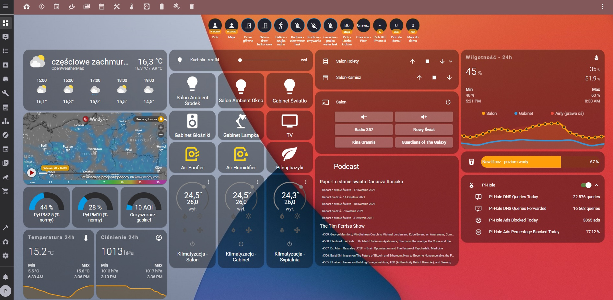

# My Home Assistant configuration

## Table of contents
- [Devices](#devices)
- [Supervisor Add-Ons](#supervisor-add-ons)
- [Automations](#automations)

### Devices
* [Raspberry Pi 4 model B 4GB RAM](https://www.raspberrypi.org/products/raspberry-pi-4-model-b/)
* [Raspberry Pi 3 model B](https://www.raspberrypi.org/products/raspberry-pi-3-model-b/)
* [RFLink 433.42 (Somfy RTS)](https://www.nodo-shop.nl/en/rflink-gateway/195-rflink-43342-somfy-rts-arduino-antenne-usb-cable.html) connected to [Arduino Mega](https://www.arduino.cc/en/pmwiki.php?n=Main/ArduinoBoardMega)
* [ZigBee2MQTT CC2531 USB Adapter](https://www.zigbee2mqtt.io/) - gateway for Ikea and Xiaomi/Aqara Zigbee devices
* [QNAP TS-251A](https://www.qnap.com/en/product/ts-251a) with [Container Station](https://www.qnap.com/solution/container_station/en/) for docker containers i.a.:
    * [MariaDB](https://mariadb.org/) - main MySQL database
    * [InfluxDB](https://www.influxdata.com/products/influxdb/) - long-term time series database
    * [Grafana](https://grafana.com/) - data visualisation, long-term charts

* [UPS Cyberpower CP900EPFCLCD](https://www.cyberpower.com/eu/EN/product/sku/CP900EPFCLCD)
* [Harman Kardon Citation One MKII](https://www.harmankardon.com/citation-series/CITATION+ONE+MK2.html)
* [IKEA TRADFRI driver for wireless control (30 watt) (light)](https://www.ikea.com/us/en/p/tradfri-driver-for-wireless-control-gray-60342661/)
* [Somfy Tilt & Lift 25 WireFree RTS CENTRAL](https://www.somfy.co.uk/products/1002295/tilt-lift-25-rts-central)
* [Sonoff Basic](https://sonoff.tech/product/diy-smart-switch/basicr2/) with [ESPHome](https://esphome.io/) firmware
* [Sonoff POW](https://sonoff.tech/product/diy-smart-switch/pow/) with [ESPHome](https://esphome.io/) firmware
* [Sonoff TH16](https://sonoff.tech/product/diy-smart-switch/th10-th16/) with [ESPHome](https://esphome.io/) firmware
* [Shelly 2.5](https://shelly.cloud/products/shelly-25-smart-home-automation-relay/) for double light switches and motorized curtains
* [Xiaomi Air Purifier](https://www.mi.com/global/air)
* [Xiaomi Air Humidifier](https://www.smartmiglobal.com/collections/home-appliances/products/smartmi-air-humidifiers-4l)
* [Xiaomi Mi Smart Temperature & Humidity Sensor](https://www.mi-store.com.au/mi-temperature-and-humidity-monitor)
* [Xiaomi Mi Smart Window & Door Sensor](https://www.mi-store.com.au/xiaomi-mi-window-and-door-sensor-1)
* [Aqara Water Leak Sensor](https://www.aqara.com/us/water_leak_sensor.html)

### Supervisor Add-Ons
* [ESPHome](https://esphome.io/)
* [File editor](https://github.com/home-assistant/addons/tree/master/configurator)
* [Mosquitto broker](https://github.com/home-assistant/addons/tree/master/mosquitto)
* [Node-RED](https://github.com/hassio-addons/addon-node-red)
* [Samba share](https://github.com/home-assistant/addons/tree/master/samba)
* [Terminal & SSH](https://github.com/home-assistant/addons/tree/master/ssh)
* [Zigbee2mqtt](https://github.com/zigbee2mqtt/hassio-zigbee2mqtt/tree/master/zigbee2mqtt)
* [motionEye](https://github.com/hassio-addons/addon-motioneye)

### Automations
A lot of automations are created in Node-RED, so here are just few of them.
1. Turn on/off internet radio

